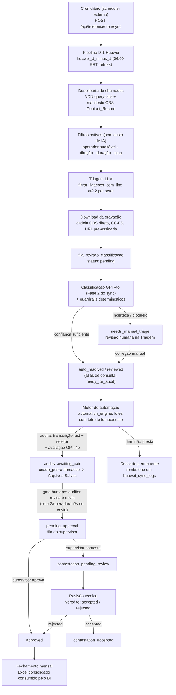

# Visão geral do sistema

> O que o sistema faz em termos de negócio, quem o usa e como uma ligação
> percorre o fluxo de ponta a ponta. Detalhe técnico do código em
> `docs/02-arquitetura.md`; operação do dia a dia em `docs/05-operacao-runbook.md`.

## 1. O que o sistema faz

Plataforma de **auditoria de qualidade de ligações telefônicas com IA** para a
operação da NSTECH. O sistema:

1. **Coleta** as gravações do dia anterior na telefonia Huawei AICC
   (automaticamente, 1x/dia) ou recebe áudio/PDF por upload manual.
2. **Seleciona** o que vale a pena auditar: filtros de negócio nativos
   (operador auditável, direção da chamada, duração, cota mensal) e uma
   triagem LLM que escolhe as melhores candidatas por setor.
3. **Classifica** cada ligação (setor, alerta, operador) com GPT-4o e
   guardrails determinísticos; casos incertos vão para revisão humana na
   Triagem em vez de seguir com falsa certeza.
4. **Audita**: transcreve o áudio (Azure Fast Transcription com seletor de
   candidatos) e avalia a ligação contra o catálogo oficial de critérios do
   setor/alerta (12 setores, 71 alertas, 1051 critérios), gerando nota,
   resumo e feedback por critério.
5. **Submete ao gate humano**: toda auditoria — automática ou manual — fica
   em **Arquivos Salvos** para o auditor revisar transcrição, critérios e
   resumo antes de enviar ao supervisor (cota de 2 auditorias por
   operador/mês aplicada no envio).
6. **Fecha o ciclo**: o supervisor aprova ou contesta; contestações passam
   por revisão técnica; o **fechamento mensal** consolida as notas em
   planilha Excel consumida pelo BI (formato é contrato — não alterar).

Princípio central da automação (esteira binária, v1.3.103+): todo item
coletado termina **auditado** ou **descartado com motivo registrado** — nada
fica preso em estados intermediários.

## 2. Quem usa

| Perfil | Role no sistema | O que faz |
| --- | --- | --- |
| Auditor(a) | `admin` | Opera triagem, auditoria manual, Arquivos Salvos (gate humano), administração de critérios/setores/colaboradores/prompts |
| Supervisor | `supervisor` | Portal próprio: aprova ou contesta auditorias da sua equipe, acompanha exportações |
| Gestores | (sem login) | Recebem relatórios/exportações; linguagem gerencial em `docs/manual-gestores/` |

**Fátima de Jesus Gutierrez é a autoridade de auditoria**: o catálogo oficial
de critérios reflete o que ela determina (ground truth). Ajustes de critérios
e calibração da IA (módulo Feedback IA) seguem a decisão dela — o sistema se
adapta à auditora, não o contrário.

## 3. Fluxo ponta a ponta

Nomes reais dos estágios e status (código em `backend/core/`, status em
`backend/db/domain_constants.py`):

Observações que evitam diagnósticos errados:

- **Painel vazio não significa IA quebrada** — normalmente os filtros nativos
  barraram as entradas (regra de negócio, intencional). Ver
  `docs/05-operacao-runbook.md` §3.
- **Auditorias automáticas e manuais se misturam em Arquivos Salvos de
  propósito**: o gate humano único é desenho, não bug de UX.
- Auditoria manual aceita também **documentos** (PDF de chat Service Cloud)
  além de áudio — o backend roteia pelo MIME do arquivo.

## 4. Stack em uma linha

FastAPI (Python 3.11) + React 19/TypeScript/Vite + PostgreSQL 17 (Neon hoje;
destino da migração indefinido) + Azure OpenAI GPT-4o (classificação e
avaliação) + Azure Speech Fast Transcription (transcrição default `fast`;
`hybrid_dual` é legado descontinuado atrás de flag) + Huawei AICC (origem das
gravações). Deploy atual: Google Cloud Run (`docs/11-deploy.md`).
