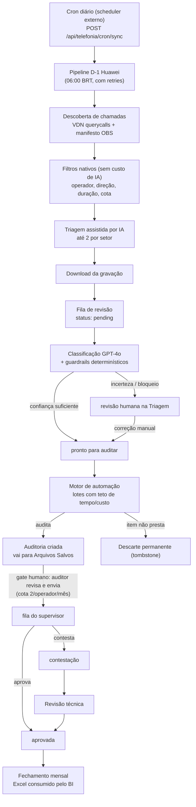

# Manual do Sistema de Auditoria de Qualidade de Ligações

> Documentação técnica e operacional do sistema de auditoria de ligações
> telefônicas com inteligência artificial da NSTECH.

---

## 0. Controle do documento

| Campo | Valor |
| --- | --- |
| **Título** | Manual do Sistema de Auditoria de Qualidade de Ligações |
| **Código** | MAN-SIS-AUD |
| **Versão do documento** | 1.0 |
| **Data de emissão** | 2026-06-24 |
| **Classificação** | Uso interno |
| **Elaboração** | Engenharia do sistema de auditoria |
| **Aprovação** | Lucas Afonso |
| **Versão do sistema na emissão** | 1.3.203 |
| **Idioma** | Português (Brasil) |

### 0.1 Histórico de revisões

| Versão | Data | Descrição da alteração | Responsável |
| --- | --- | --- | --- |
| 1.0 | 2026-06-24 | Emissão inicial do manual consolidado | Engenharia |

### 0.2 Como ler este manual

Este documento é **autocontido**: pode ser lido do início ao fim sem abrir
nenhum outro arquivo. Ele combina três níveis de leitura, para servir tanto a
quem opera o sistema quanto a quem mantém o código:

1. **Explicação em linguagem direta** — o "o que faz e por quê", sem exigir
   conhecimento de programação.
2. **Trecho de código real** — sempre que um conceito tem um ponto exato no
   código, ele é mostrado em um quadro com a referência do arquivo e da linha,
   no formato `arquivo:linha`. Esses quadros existem para quem quer aprender
   como aquilo funciona por dentro; podem ser pulados sem perda do entendimento
   geral.
3. **Telas** — os fluxos de uso são acompanhados de um esboço da interface
   (layout fiel, com os rótulos reais que aparecem na tela) e a explicação de
   cada controle.

> **Convenção dos quadros de código.** Cada trecho começa com a referência
> `arquivo:linha` do código-fonte de onde foi extraído. O código é reproduzido
> como está no repositório; quando encurtado, o corte é sinalizado com `...`.

### 0.3 Documentos relacionados

Este manual consolida e formaliza a documentação técnica do repositório. Para
o detalhe vivo e sempre atualizado de cada tema, as fontes são:

| Tema | Fonte no repositório |
| --- | --- |
| Índice da documentação técnica | `docs/README.md` |
| Visão de negócio | `docs/01-visao-geral.md` |
| Mapa do código | `docs/02-arquitetura.md` |
| Schema do banco de dados | `docs/03-banco-de-dados.md` |
| Variáveis de ambiente | `docs/04-variaveis-de-ambiente.md` e `backend/.env.example` |
| Operação e diagnóstico | `docs/05-operacao-runbook.md` |
| Integração Huawei | `docs/06-integracao-huawei.md` |
| Custos e proteções | `docs/07-custos-e-guardrails.md` |
| Segurança | `docs/08-seguranca.md` |
| Testes | `docs/09-testes.md` |
| Histórico de mudanças | `logs/versions/x.y.z.md` |

---

## 1. Objetivo e escopo

### 1.1 Objetivo

O sistema tem um objetivo único: **medir e garantir a qualidade do atendimento
telefônico** da operação, de forma padronizada, rastreável e com o mínimo de
trabalho manual. Ele ouve as ligações, transcreve, compara o atendimento com os
critérios oficiais de qualidade e produz uma nota com justificativa por
critério — o que antes dependia de um auditor ouvir ligação por ligação.

A inteligência artificial faz o trabalho pesado (transcrever e avaliar), mas a
**palavra final é humana**: nenhuma auditoria chega ao supervisor sem passar
pela revisão de um auditor.

### 1.2 Escopo

Está dentro do escopo deste sistema:

- Coletar automaticamente as gravações do dia anterior na telefonia Huawei AICC.
- Receber áudio ou documento (PDF de chat) por envio manual.
- Selecionar o que vale a pena auditar, aplicando regras de negócio e uma
  triagem assistida por IA.
- Classificar cada ligação (setor, alerta, operador).
- Transcrever o áudio e avaliar a ligação contra o catálogo oficial de
  critérios.
- Submeter toda auditoria a um gate humano antes do envio ao supervisor.
- Encaminhar o fluxo de aprovação/contestação e consolidar o fechamento
  mensal.

Está **fora** do escopo:

- O sistema não substitui o julgamento do auditor — ele prepara e organiza o
  material; a decisão de enviar é humana.
- O sistema não altera o formato do fechamento consumido pelo BI (é um contrato
  externo).
- O sistema não decide os critérios de qualidade: o catálogo oficial reflete a
  autoridade de auditoria (ver §4).

### 1.3 Princípio central: a esteira binária

O princípio que organiza toda a automação, e que vale a pena fixar antes de
qualquer detalhe, é a **esteira binária**: no modo automático, **todo item
coletado termina em um de dois estados — auditado ou descartado com motivo
registrado**. Nada fica "preso" em um estado intermediário esperando alguém.

Isso tem uma consequência prática importante para o diagnóstico do dia a dia:
quando o painel aparece vazio, **não é sinal de falha** — é, quase sempre, o
resultado esperado dos filtros de negócio terem barrado as entradas. Cada
descarte fica registrado com seu motivo.

---

## 2. Termos e definições

Glossário dos termos usados ao longo do manual e na própria interface.

| Termo | Significado |
| --- | --- |
| **Ligação / chamada** | Uma gravação de atendimento telefônico, a unidade de trabalho do sistema. |
| **Coleta / sync** | Processo automático que busca as gravações do dia anterior na Huawei. |
| **Pipeline D-1** | A rotina diária que processa o lote do "dia menos 1" (ontem). |
| **Manifesto** | A lista de todas as gravações que a Huawei reporta para um dia. |
| **Filtro de negócio** | Regra que descarta uma ligação antes de gastar IA (duração, direção, operador não cadastrado, etc.). |
| **Triagem** | Etapa que escolhe, entre as candidatas, as melhores para auditar — manual (auditor) ou assistida por IA. |
| **Classificação** | Identificação de setor, alerta e operador de uma ligação. |
| **Alerta** | A categoria/motivo de auditoria associada à ligação (define quais critérios se aplicam). |
| **Critério** | Cada item objetivo avaliado na ligação (ex.: "confirmou os dados do cliente"). |
| **Setor** | A operação/equipe à qual a ligação pertence (ex.: Fênix, UTI, Central). |
| **Auditoria** | O resultado da avaliação: nota, resumo e feedback por critério. |
| **Zeragem** | Quando uma falha grave zera a nota da auditoria, independentemente dos demais critérios. |
| **Arquivos Salvos** | A área onde toda auditoria (automática ou manual) aguarda a revisão humana. |
| **Gate humano** | O ponto obrigatório em que um auditor revisa a auditoria antes de enviá-la ao supervisor. |
| **Cota** | Limite de 2 auditorias por operador por mês no envio ao supervisor. |
| **Esteira binária** | O princípio de que todo item automático termina auditado ou descartado (ver §1.3). |
| **Tombstone** | Marca permanente de descarte — a ligação descartada não volta em coletas futuras. |
| **Guardrail** | Proteção determinística (não-IA) que impõe uma regra ou um limite. |
| **Kill-switch** | Chave que corta imediatamente todo o consumo pago de IA, sem precisar de redeploy. |
| **Fechamento** | A consolidação mensal das notas em planilha Excel para o BI. |
| **Role** | O papel do usuário no sistema (`admin` ou `supervisor`), que define o que ele pode fazer. |

---

## 3. Visão geral do sistema

### 3.1 O que o sistema faz, em seis passos

1. **Coleta.** Uma vez por dia, busca as gravações do dia anterior na telefonia
   Huawei AICC. Também aceita áudio ou PDF por envio manual.
2. **Seleciona.** Aplica filtros de negócio (operador auditável, direção da
   chamada, duração, cota) e uma triagem assistida por IA que escolhe as
   melhores candidatas por setor — tudo isso **antes** de gastar IA.
3. **Classifica.** Identifica setor, alerta e operador com GPT-4o, apoiado por
   guardrails determinísticos. Casos incertos vão para revisão humana em vez de
   seguir com falsa certeza.
4. **Audita.** Transcreve o áudio (Azure Fast Transcription com seletor de
   candidatos) e avalia a ligação contra o catálogo oficial de critérios do
   setor/alerta (12 setores, 71 alertas, 1051 critérios), gerando nota, resumo
   e feedback por critério.
5. **Submete ao gate humano.** Toda auditoria — automática ou manual — fica em
   **Arquivos Salvos** para o auditor revisar antes de enviar ao supervisor (a
   cota de 2 por operador/mês é aplicada no envio).
6. **Fecha o ciclo.** O supervisor aprova ou contesta; contestações passam por
   revisão técnica; o fechamento mensal consolida as notas na planilha do BI.

### 3.2 O caminho de uma ligação, do início ao fim

O diagrama abaixo mostra os estágios reais e os status que uma ligação assume.
Os nomes são os mesmos usados no código (`backend/core/`) e nas constantes de
status (`backend/db/domain_constants.py`).



### 3.3 Três observações que evitam diagnósticos errados

- **Painel vazio não significa IA quebrada.** Quase sempre, os filtros de
  negócio barraram as entradas — é regra de negócio, intencional.
- **Auditorias automáticas e manuais se misturam em Arquivos Salvos de
  propósito.** O gate humano é único; isso é desenho, não defeito.
- **A auditoria manual também aceita documentos** (PDF de chat), além de áudio.
  O sistema decide o caminho pelo tipo do arquivo enviado.

### 3.4 A pilha de tecnologia, em uma linha

FastAPI (Python 3.11) + React 19/TypeScript/Vite + PostgreSQL 17 + Azure OpenAI
GPT-4o (classificação e avaliação) + Azure Speech Fast Transcription
(transcrição) + Huawei AICC (origem das gravações). O sistema roda como um
único container.

---

## 4. Papéis e responsabilidades

### 4.1 Perfis de uso

| Perfil | Papel no sistema (`role`) | O que faz |
| --- | --- | --- |
| **Auditor(a)** | `admin` | Opera a triagem, a auditoria manual e os Arquivos Salvos (o gate humano). Administra critérios, setores, colaboradores e prompts. |
| **Supervisor** | `supervisor` | Tem um portal próprio: aprova ou contesta as auditorias da sua equipe e acompanha as exportações. |
| **Gestores** | (sem login) | Recebem relatórios e exportações. A linguagem gerencial está em `docs/manual-gestores/`. |

O papel do usuário (`role`) é o que o sistema usa para liberar ou bloquear cada
ação — o detalhe técnico de como isso é verificado está na §8 (Segurança).

### 4.2 A autoridade de auditoria

**Fátima de Jesus Gutierrez é a autoridade de auditoria.** O catálogo oficial de
critérios reflete o que ela determina — é o "gabarito" (ground truth) contra o
qual a IA é calibrada. Ajustes de critérios e a calibração da IA seguem a
decisão dela: **o sistema se adapta à auditora, não o contrário.** Esse
princípio é o que dá legitimidade à nota que o sistema produz.

---

## 5. Arquitetura e componentes

### 5.1 Visão de alto nível

O sistema é um **monorepo full stack** servido por um **único container** em
produção. Isso costuma surpreender: não há "servidor do frontend" separado do
"servidor do backend". O mesmo processo FastAPI:

- expõe a API em `/api/*`, e
- entrega o site (o build do React/Vite) em todo o resto das URLs.

A montagem do site dentro da API é literal — está no fim do `main.py`:

> 📄 `backend/main.py:483-508`
>
> ```python
> dist_path = os.path.abspath(os.path.join(os.path.dirname(__file__), "..", "dist"))
> if os.path.exists(dist_path):
>     logger.info("Servindo frontend em: %s", dist_path)
>
>     class CacheControlStaticFiles(StaticFiles):
>         async def get_response(self, path: str, scope):
>             ...
>             if response.status_code == 404:
>                 response = await super().get_response("index.html", scope)  # fallback da SPA
>             ...
>             return response
>
>     app.mount("/", CacheControlStaticFiles(directory=dist_path, html=True), name="static")
> ```

O que dá para aprender aqui: quando o navegador pede uma rota que não existe
como arquivo (ex.: `/auditoria`), o servidor devolve o `index.html` (o "fallback
da SPA"), e o React assume o roteamento. Arquivos estáticos com hash no nome
(`assets/...`) recebem cache "para sempre"; o HTML recebe "nunca cachear" — é o
que garante que uma nova versão do sistema apareça na hora para o usuário.

A estrutura de pastas do repositório:

```text
auditoria/
|-- backend/          # FastAPI (Python 3.11) — a API e toda a lógica
|-- src/              # React 19 + TypeScript + Vite + Tailwind — as telas
|-- tests/            # tests/backend (pytest) + tests/frontend (Node)
|-- scripts/          # diagnósticos pontuais + scripts/migration/
|-- docs/             # documentação técnica (índice em docs/README.md)
|-- logs/versions/    # changelog técnico por versão (x.y.z.md)
|-- rag/sources/      # fontes curadas dos procedimentos (RAG)
|-- Dockerfile        # multi-stage: build do Vite -> Python 3.11 + ffmpeg
```

### 5.2 Backend, por subsistema

Toda a API é montada juntando "routers" — cada um cobre um domínio. O wiring
fica explícito no `main.py`, e ler essa lista é a forma mais rápida de entender
de quantas partes o sistema é feito:

> 📄 `backend/main.py:463-480`
>
> ```python
> app.include_router(auth_router)          # login e sessão
> app.include_router(system_router)        # health, configurações dinâmicas
> app.include_router(saved_files_router)   # Arquivos Salvos (gate humano)
> app.include_router(audit_router)         # auditoria manual
> app.include_router(classifier_router)    # triagem / classificação
> app.include_router(supervisor_router)    # portal do supervisor
> app.include_router(review_router)        # revisão técnica de contestações
> app.include_router(admin_router)         # administração
> app.include_router(automation_router)    # motor de automação
> app.include_router(telefonia_router)     # integração Huawei
> ...                                      # + critérios, setores, prompts, fechamento
> ```

Dentro de `backend/core/`, a lógica é dividida por assunto:

| Subsistema | Onde fica | O que faz |
| --- | --- | --- |
| Transcrição | `core/transcription*.py` | Converte áudio em texto; engine default `fast`, com cadeia de fallback e um seletor de candidatos. |
| Classificação | `core/classification.py`, `core/llm_triage.py` | Identifica setor/alerta/operador; triagem das candidatas. |
| Elegibilidade | `core/automation_guardrails.py` | **Fonte única** das regras de "esta ligação pode ser auditada?" (usada pelo sync e pela automação). |
| Avaliação | `core/audit_evaluator.py`, `core/evaluation.py` | Compara a ligação com os critérios e calcula a nota (inclui a zeragem). |
| Automação | `core/automation*.py` | O motor que audita em lote, com lock, heartbeat e descarte com tombstone. |
| Huawei | `core/huawei*.py`, `core/huawei/` | Descoberta, coleta D-1, sync, cadeia de download. |
| Custo | `core/cost_guard.py` | Tetos diários e kill-switch (ver §9). |

> **Decisão de arquitetura que vale memorizar:** as regras de elegibilidade têm
> **uma fonte só** (`AutomationGatekeeper`). O sync e a automação chamam a mesma
> função — uma regra nunca é duplicada em dois lugares, o que evita que mudem
> uma e esqueçam a outra.

### 5.3 Frontend, por feature

As telas são organizadas por domínio em `src/features/<dominio>/`. Cada feature
é um conjunto de tela + lógica + chamadas à API:

| Feature (`src/features/`) | Tela / fluxo |
| --- | --- |
| `classifier/` | Triagem (entrada do fluxo) |
| `audit/` | Auditoria manual (upload, configuração, resultado) |
| `saved-files/` | Arquivos Salvos (o gate humano) |
| `supervisor/` | Portal do supervisor |
| `review/` | Revisão técnica de contestações |
| `fechamento/` | Fechamento mensal |
| `dashboard/` | Indicadores e histórico |
| `automacao/` | Painel do motor de automação |
| `telefonia/` | Sync Huawei (status, disparo manual, diagnósticos) |
| `admin/` | Critérios, setores, prompts |
| `colaboradores/` | Cadastro de operadores (o campo "ID Huawei" controla o sync) |
| `ai-feedback/` | Calibração da IA |

### 5.4 As camadas de dados

Uma regra de organização importante: **o SQL não fica nos routers.** Ele fica
em `repositories/` (um arquivo por agregado: `audits`, `telefonia`, `operators`,
`configuration`, `auth_users`, ...). Os routers chamam os repositórios; os
repositórios falam com o banco. Isso mantém a API limpa e o acesso a dados
testável.

O acesso físico ao banco fica em `db/`:

- `db/connection.py` — o pool de conexões (psycopg2), com timeouts e
  `sslmode=require` para hosts remotos.
- `db/database.py` — a fachada: `init_db()` roda migrations + seeds idempotentes
  no boot.
- `db/migration_steps/` — a única forma de evoluir o schema (ver §5.6).
- `db/domain_constants.py` — os status canônicos (os nomes de estado usados no
  fluxo da §3.2).

### 5.5 O que é legado (não usar como referência)

| Item | Situação |
| --- | --- |
| `hybrid_dual` (engine de transcrição) | **Descontinuado.** Só roda atrás de uma flag de legado; a engine validada e em uso é a `fast`. |
| `scripts/` e `backend/scripts/` | Diagnósticos pontuais acumulados; nada disso roda em produção. |
| Restos de Gemini/AssemblyAI no código | Compatibilidade antiga; o caminho validado é 100% Azure. |

### 5.6 Decisões de arquitetura registradas

- **O schema do banco evolui só por `db/migration_steps/`** (um runner aplica os
  passos em ordem, com commit por passo). Não se edita o schema base para
  mudanças novas — cria-se um passo de migração.
- **Histórico de mudanças** vive em `logs/versions/x.y.z.md`: uma entrada por
  versão, com objetivo, arquivos alterados e validação. É o lugar para consultar
  *por que* um comportamento é como é.

---

## 6. Fluxo operacional do dia a dia

Esta seção é o coração do manual: como uma ligação sai da telefonia e chega a
uma auditoria revisada — e, principalmente, **por que o número auditado por dia
costuma ser muito menor do que o total de ligações** (a dúvida mais comum).

### 6.1 O ciclo diário

O ciclo é disparado de fora, uma vez por dia, por um agendador (hoje o Cloud
Scheduler) que chama um endpoint protegido por token:

> 📄 `backend/routers/telefonia_routes/cron_d1.py:53-73`
>
> ```python
> @router.post("/cron/sync")
> async def cron_sync_d_minus_1(request: Request, body: Optional[dict] = Body(default=None)):
>     """Gatilho dedicado do scheduler externo para o Coletor D-1/OBS.
>
>     Agendado 1x/dia. (...) o pipeline `executar_d_minus_1_pipeline` já se
>     auto-governa — respeita `huawei_d1_enabled` (...), o horário configurado e
>     a tabela de runs por dia (um lote por data; disparos extras no mesmo dia
>     não reexecutam lote completo)."""
>     from routers.automation import _require_cron_token
>     _require_cron_token(request)          # exige Authorization: Bearer <token>
>     ...
>     return await sync_d_minus_1(request, body)
> ```

O que se aprende aqui: o ciclo **se auto-governa**. Mesmo que o agendador chame
duas vezes no mesmo dia, o sistema não reprocessa o lote inteiro — há uma tabela
de execuções por data que controla isso. E o "horário de início" configurado na
tela é um **portão** (só roda depois dele), não um gatilho — quem dispara é o
cron externo.

Depois do disparo, o ciclo tem três grandes momentos:

1. **Coleta (sync):** baixa o manifesto de ontem, aplica os filtros, faz a
   triagem por setor, baixa os áudios aprovados e classifica.
2. **Automação:** o motor audita os itens prontos, em lotes limitados por tempo
   e custo, e joga o resultado em Arquivos Salvos.
3. **Gate humano:** o auditor revisa e promove para o supervisor.

### 6.2 A coleta e os filtros — onde o volume "encolhe"

Quando o manifesto do dia chega, ele costuma trazer **milhares** de gravações. A
maioria é descartada por **regras de negócio**, antes de gastar qualquer IA. O
primeiro filtro decide se a ligação deve ser pulada:

> 📄 `backend/core/huawei_sync.py:1077-1082`
>
> ```python
> skip_reason = _should_skip_call(interacao, operador_resolvido)
> if skip_reason:
>     _increment_skip_counter(contadores, skip_reason)
>     _register_direction_skip(call_id, interacao, operador_resolvido, skip_reason)
>     continue
> ```

`_should_skip_call` concentra as regras "duras": **operador não cadastrado**,
**direção da chamada desconhecida ou de risco** (ex.: receptiva em setor
sensível) e **setor não-telefonia**. Logo em seguida vem o filtro de **duração**:

> 📄 `backend/core/huawei_sync.py:1115-1124`
>
> ```python
> duration = get_call_duration_seconds(interacao)
> duration_known = _call_duration_is_known(interacao)
> if duration_known and duration < min_sec:
>     contadores["ignoradas_duracao_minima"] += 1
>     continue
> if duration_known and max_sec > 0 and duration > max_sec:
>     contadores["ignoradas_duracao_maxima"] += 1
>     continue
> ```

Ligações curtas demais (silêncio, engano, URA) não têm o que auditar e são
cortadas. Esses filtros são **intencionais**: é o que garante que a IA só seja
gasta com ligações que valem auditoria.

### 6.3 O teto por operador — e por que ele foi separado da cota

Havia ainda um terceiro corte, e é o ponto que mudou na versão 1.3.202. Para não
auditar muitas ligações do mesmo operador, o sistema limita quantas gravações de
um mesmo operador entram por ciclo:

> 📄 `backend/core/huawei_sync.py:1084-1106`
>
> ```python
> op_key = (op_name_norm, op_id_norm)
> current_op_count = download_count_by_operator.get(op_key, 0)
>
> if cap_op_ciclo > 0 and (op_name_norm or op_id_norm) and current_op_count >= cap_op_ciclo:
>     contadores["ignoradas_cota_mensal_pre_download"] += 1
>     database.huawei_sync_log_registrar(
>         call_id=call_id,
>         status="skipped_quota",
>         failure_reason="teto_download_por_operador_ciclo",
>         ...
>     )
>     continue
> ```

**O problema que isso resolveu.** Antes, esse teto reutilizava a configuração da
*cota do supervisor* (`huawei_cota_max_por_operador_mes`, que vale **2**) e ainda
pré-carregava as auditorias já feitas no mês. Resultado: o download ficava preso
em ~2 ligações por operador, e quem já tinha 2 auditorias no mês nem era baixado.
Com poucos operadores no dia, 2 × N ≈ 20 — era essa a causa de "pedi 400 e veio
20".

**A correção** foi **desacoplar**: criar um teto próprio do download
(`_download_max_por_operador_ciclo`, default **10**, `0` = sem limite),
contado fresco a cada ciclo, sem olhar o histórico mensal. A cota de 2/mês do
supervisor continua intacta, governando **só o envio** (ver §7.3).

### 6.4 Quantas baixar: a "Meta" e o teto de segurança

Quantas ligações o ciclo tenta baixar/auditar é a **Meta de auditorias** que
você configura na tela. O número de downloads segue a meta, 1 para 1, com um
teto de segurança fixo:

> 📄 `backend/core/huawei/automation_config.py:178-221`
>
> ```python
> HUAWEI_SYNC_DOWNLOAD_HARD_CEILING = 500   # (definido no topo do módulo)
>
> def _effective_download_attempt_limit() -> int:
>     """Quantos downloads tentar por ciclo (clamp [1, HUAWEI_SYNC_DOWNLOAD_HARD_CEILING]).
>     O numero EFETIVO segue a META de auditorias do ciclo (downloads = meta, 1:1) (...).
>     Em TODOS os casos o resultado e limitado ao teto fixo (500): a meta governa o
>     volume, o teto e so a trava de seguranca."""
>     ...
>     return max(1, min(HUAWEI_SYNC_DOWNLOAD_HARD_CEILING,
>                       _coerce_int(raw_audit_target, DEFAULT_HUAWEI_SYNC_DOWNLOAD_LIMIT)))
> ```

Em linguagem simples: **a Meta é o alvo, não a "entrada bruta".** Se você quer
auditar 200, configure 200 — não 1000. Os filtros cortam a lista crua do dia, e
não o seu número. O único limite extra é o teto de segurança de **500 por
ciclo**: acima disso é preciso mais de um disparo no dia.

### 6.5 O funil com números reais

Vale ver o funil de um dia real (manifesto de **5.513** ligações) para entender
onde o volume vai. Cada linha é um contador real registrado pelo ciclo:

| Etapa | Quantas | Tipo |
| --- | --- | --- |
| Manifesto do dia | 5.513 | total |
| Muito curtas (< 2 min) | 2.007 | filtro de negócio |
| Receptiva em setor de risco | 1.069 | filtro de negócio |
| Operador não cadastrado | 980 | filtro de negócio |
| Teto por operador (era 2) | 584 | **ajustado na v1.3.202** |
| Direção desconhecida | 368 | filtro de negócio |
| Setor não-telefonia | 285 | filtro de negócio |
| Triagem | 90 | seleção |
| Já sincronizadas antes | 2 | dedup |
| **Sobraram e foram baixadas** | **~51** | — |

A leitura: a esmagadora maioria (≈4.700) cai em **filtros de negócio legítimos**.
Apenas as **584** do "teto por operador" eram um aperto artificial — e é
exatamente esse bloco que a v1.3.202 libera ao trocar o teto de 2 para 10.

### 6.6 A classificação

As ligações que passam pela coleta são classificadas (setor, alerta, operador)
com GPT-4o e guardrails. Um detalhe que vale conhecer: alertas têm **apelidos**
(aliases), e o sistema sempre resolve o nome canônico antes de consultar os
critérios — pela função pública:

> 📄 `backend/core/classification.py:511-513`
>
> ```python
> def canonicalize_alert_id(alert_id: str) -> str:
>     """API publica para resolver aliases (ex.: BAS-POLICIAL -> BAS-PRIORITARIO-POLICIA)."""
>     return _canonicalize_alert_id(alert_id)
> ```

Quando a classificação fica **incerta**, o item não segue com falsa certeza: vai
para **revisão humana** na Triagem. Valores não reconhecidos permanecem
`desconhecido` (sem "chute" silencioso), justamente para um humano decidir.

### 6.7 Endpoints de diagnóstico (operação)

| Endpoint | Para quê |
| --- | --- |
| `GET /api/health` | O serviço está vivo? |
| `GET /api/telefonia/sync/diagnostics` | Visão geral: sync travado?, lock do banco, e o bloco `custo_diario` (consumo + tetos + kill-switch). |
| `GET /api/automation/engine/status` | Estado do motor (ciclo atual, estágio, último erro). |
| `POST /api/automation/run-now` (admin) | Dispara um ciclo manual (depuração). |
| `POST /api/telefonia/sync/reset-lock` (admin) | Destrava o sync após uma falha no meio do caminho (também expira sozinho em 30 min). |

> **Diagnóstico nº 1 do dia a dia:** "a automação não está auditando nada".
> Antes de suspeitar da IA, olhe os filtros — operador sem "ID Huawei"
> cadastrado, direção inválida ou cota do mês atingida barram as entradas, e
> isso fica registrado com motivo. Painel vazio quase sempre é regra de negócio
> funcionando, não defeito.

### 6.8 Agendamento (cron) — como ligar o ciclo diário

O ciclo diário **não começa sozinho**: ele é disparado por um **agendador
externo** (scheduler) que chama um endpoint do sistema, uma vez por dia. Esta
seção é o passo a passo para configurar esse agendamento.

**O que o agendador precisa chamar:**

| Item | Valor |
| --- | --- |
| Endpoint | `POST /api/telefonia/cron/sync` |
| Autenticação | Header `Authorization: Bearer <CRON_SECRET_TOKEN>` |
| Frequência | 1x por dia |
| Corpo (body) | vazio — o pipeline decide sozinho a data (o dia anterior) |

**Passo a passo:**

1. **Garanta o token.** A variável de ambiente `CRON_SECRET_TOKEN` deve estar
   definida no servidor; o **mesmo valor** vai no header `Authorization` do
   agendador. Sem token configurado, o endpoint responde 503/403 (é
   fail-closed, de propósito).
2. **Crie o job agendado** que faz a chamada HTTP uma vez ao dia (exemplos
   abaixo).
3. **Confirme que a automação está ligada.** A chave `huawei_d1_enabled` (o
   toggle no painel de Automação) precisa estar em `true`. Com ela desligada, o
   pipeline **não roda** mesmo recebendo a chamada do cron.
4. **Ajuste o horário-portão.** O campo "Horário de início" no painel é um
   **portão** (o ciclo só roda a partir daquele horário), **não** o gatilho. O
   gatilho é o agendador externo.

**Exemplo — chamada HTTP crua (para testar):**

```bash
curl -X POST https://<seu-dominio>/api/telefonia/cron/sync \
  -H "Authorization: Bearer $CRON_SECRET_TOKEN"
```

**Exemplo — Google Cloud Scheduler (ambiente atual):**

```bash
gcloud scheduler jobs create http auditoria-d1 \
  --schedule="0 6 * * *" \                       # ajuste para o horário desejado
  --uri="https://<seu-dominio>/api/telefonia/cron/sync" \
  --http-method=POST \
  --headers="Authorization=Bearer <CRON_SECRET_TOKEN>" \
  --time-zone="America/Sao_Paulo"
```

(`0 6 * * *` = todo dia às 06:00 — a expressão segue o padrão cron:
`minuto hora dia-do-mês mês dia-da-semana`.)

**Exemplo — Azure (ambiente de destino):** usar um **Container Apps Job
agendado** ou uma **Logic App** fazendo a mesma chamada HTTP, com o mesmo
header `Authorization`. Regra de ouro: deixar **apenas um** agendador ativo, para
não duplicar coleta e auditoria.

**Comportamento seguro do cron:**

- **Idempotente por dia:** disparos extras no mesmo dia **não** reprocessam o
  lote inteiro — há uma tabela de execuções por data que controla isso.
- **Fail-closed:** token ausente → 503/403; token errado → 403.
- **Auto-governado:** respeita o toggle `huawei_d1_enabled`, o horário-portão e
  os limites de custo (§9).

**Como verificar que rodou:**

| Endpoint | Mostra |
| --- | --- |
| `GET /api/telefonia/sync/d-minus-1/status` | As últimas execuções (data, status, tentativas, erro). |
| `GET /api/telefonia/sync/diagnostics` | A visão do dia, incluindo o bloco `custo_diario`. |

---

## 7. Regras de negócio e critérios

### 7.1 A cota de envio ao supervisor (2 por operador/mês)

Há um limite de compliance: **no máximo 2 auditorias por operador, por mês,
são enviadas ao supervisor.** O ponto sutil — e que costuma ser confundido com o
teto de download da §6.3 — é **onde** a cota é aplicada:

> 📄 `backend/core/automation_config.py:223-234`
>
> ```python
> def _get_monthly_audit_quota() -> int:
>     """Cota mensal de auditorias por operador (config `huawei_cota_max_por_operador_mes`, default 2).
>
>     Obs.: com `AUTOMATION_AUDIT_IGNORE_MONTHLY_CAP` ON (default), a cota só é
>     aplicada no ENVIO ao supervisor, não na auditoria automática."""
>     raw = database.get_config_value("huawei_cota_max_por_operador_mes", "2")
>     ...
>     return max(1, int(str(raw or "2").strip()))
> ```

Ou seja: a automação **audita** tudo o que presta (esteira binária), e a cota
de 2/mês só decide o que **sobe** para o supervisor. São dois limites diferentes:

| Limite | Valor padrão | Onde age | Config |
| --- | --- | --- | --- |
| Teto de download por operador | 10 por ciclo | Na coleta (§6.3) | `huawei_download_max_por_operador_ciclo` |
| Cota mensal por operador | 2 por mês | No envio ao supervisor | `huawei_cota_max_por_operador_mes` |

Quando a cota do mês está cheia, o auditor apaga uma auditoria anterior daquele
operador para liberar espaço.

### 7.2 Direção da chamada

O sistema distingue chamada **feita** de chamada **recebida**. A direção vem de
uma consulta à central Huawei (VDN), sem custo de IA. Chamadas sem direção
definida, ou receptivas em setores de risco, são barradas na coleta (§6.2) —
porque a regra de auditoria depende de quem originou a ligação.

### 7.3 Setores e apelidos

Cada ligação pertence a um **setor** (ex.: Fênix, UTI, Central). Um detalhe de
projeto que vale conhecer: o setor tem um **id interno fixo** (do qual as regras
dependem) e um **rótulo editável** na tela. O vínculo entre os dois é feito por
apelidos (`sector_aliases`), então **renomear o rótulo na tela não quebra
nenhuma regra**. Alertas seguem a mesma ideia de apelidos, resolvidos pela
`canonicalize_alert_id` (§6.6).

### 7.4 O catálogo de critérios

A avaliação compara a ligação com o **catálogo oficial**: **12 setores, 71
alertas e 1051 critérios**, guardados no banco (`audit_sectors`, `audit_alerts`,
`audit_criteria`). Esse catálogo reflete a autoridade de auditoria (§4.2).

Uma proteção importante: se o catálogo do setor/alerta estiver **vazio** no
momento da avaliação, o item **volta para a triagem manual** em vez de ser
avaliado sem critério. O sistema prefere admitir "não sei avaliar isto" a
produzir uma nota sem base.

### 7.5 A nota e a zeragem

A nota parte de **10** e desconta a cada falha, seguindo o peso de cada critério:

> 📄 `backend/core/evaluation.py:106-112`
>
> ```python
> """Calcula (score_obtido, score_maximo) para um critério seguindo a lógica da planilha BD.
>
> A nota final é: 10.0 - sum(Peso + abs(Deflator) para cada falha).
> Isso significa que para cada critério, o score_obtido é:
> - PASS: Peso
> - FAIL: Peso - (Peso + abs(Deflator)) = -abs(Deflator)"""
> ```

Acima disso existe a **zeragem**: certas falhas graves **zeram a auditoria
inteira**, independentemente dos outros critérios. Ela é aplicada em **três
camadas**, da mais segura para a mais tolerante:

> 📄 `backend/core/evaluation.py:15-17`
>
> ```python
> #   ... a zeragem por critério fatal em 3 camadas
> #   (criterionId determinístico → fatal_flags da IA → fallback por substring),
> #   respeitando o fallback legítimo de CPF quando o motorista confirma não ter senha.
> ```

Em linguagem direta: (1) primeiro, regras determinísticas por id de critério;
(2) depois, os "sinais fatais" que a própria IA apontou; (3) por fim, um
fallback por texto. Exemplo clássico: **não solicitar a senha de segurança
quando ela é exigida zera a auditoria** — mas com uma exceção legítima já
prevista (quando o motorista confirma não ter senha e o CPF é aceito).

---

## 8. Segurança e proteção de dados

### 8.1 Acesso e papéis

- **Login:** cookie de sessão assinado com HMAC-SHA256 (chave `SESSION_SECRET`),
  senha guardada com bcrypt, validade de 8 horas. A mensagem de erro é sempre a
  mesma ("Credenciais inválidas"), para não revelar se um usuário existe.
- **Autorização por papel:** cada rota exige o papel certo, por uma "dependência"
  reutilizável. É assim que uma rota de administração se protege:

> 📄 `backend/routers/auth.py:325-336`
>
> ```python
> def require_admin(request: Request) -> dict:
>     """Dependencia FastAPI: exige usuario autenticado com role 'admin'.
>     Levanta HTTP 401 se nao autenticado e HTTP 403 se nao for admin."""
>     user = require_authenticated_user(request)
>     if user["role"] != "admin":
>         raise HTTPException(status_code=status.HTTP_403_FORBIDDEN,
>                             detail="Acesso restrito a administradores.")
>     return user
> ```

- **Limites de tentativa:** o login tem um limitador dedicado (5 tentativas
  falhas por 5 minutos) e a API tem um limitador global, para conter abuso.

### 8.2 Rede

- **CORS restritivo:** em produção, o sistema **recusa iniciar** se as origens
  permitidas forem `*` — elas têm de ser explícitas.
- **Cabeçalhos de segurança** em toda resposta: `X-Content-Type-Options: nosniff`,
  `X-Frame-Options: DENY`, `Referrer-Policy: no-referrer`, HSTS em produção,
  entre outros.
- **Endpoints de cron** protegidos por Bearer token, com comportamento
  fail-closed (§6.8).

### 8.3 Segredos

Nenhum segredo fica escrito no código — tudo vem de **variáveis de ambiente**.
Os arquivos `.env` reais ficam **fora do controle de versão** (apenas
`.env.example`, sem valores, é versionado). Em produção, o recomendado é guardar
os segredos em um cofre (ex.: Azure Key Vault) e injetá-los por referência.

São **obrigatórias em produção**: `ENVIRONMENT=production`,
`SESSION_COOKIE_SECURE=true` e `ALLOWED_ORIGINS` com as origens exatas do
frontend.

### 8.4 Proteção de dados (LGPD)

O sistema lida com gravações de atendimento e dados de operadores — informação
sensível. Os controles que sustentam a conformidade:

- **Acesso por papel:** só usuários autenticados, e cada ação exige o papel
  adequado (§8.1).
- **Retenção:** os áudios classificados têm limpeza automática por retenção
  (30 dias por padrão).
- **Rastreabilidade:** ações relevantes e mudanças de configuração ficam
  registradas (§10).

### 8.5 O dado de produção é protegido contra a suíte de testes

A suíte de testes **escreve no banco**. Para que ela nunca rode por engano
contra o banco de produção, há uma trava:

> 📄 `tests/backend/conftest.py:91-96`
>
> ```python
> if "ep-aged-river" in db_url and os.getenv("ALLOW_TESTS_ON_PROD_DB") != "1":
>     raise pytest.UsageError(
>         "Suite BLOQUEADA: DATABASE_URL aponta para o banco de PRODUCAO (ep-aged-river). "
>         "Testes escrevem no banco e poluiriam producao. Use um banco de teste (...)."
>     )
> ```

A regra prática: **os testes rodam sempre contra um banco de teste, nunca contra
produção.**

---

## 9. Custos e contingência

### 9.1 Onde há custo

O sistema usa serviços pagos de IA: **GPT-4o** (classificação e avaliação) e
**Azure Speech** (transcrição). Uma auditoria automática típica custa três
chamadas: 1 transcrição + 1 classificação + 1 avaliação.

### 9.2 Proteções de custo (guardrails)

Para garantir um teto de gasto **previsível**, o sistema tem proteções
estruturais, independentes de qualquer configuração de cadência ou engine:

1. **Teto diário de chamadas de IA** — padrão **1500** por dia. Ao atingir,
   o pipeline para de pegar itens novos; nada é descartado, a fila espera o dia
   seguinte.
2. **Teto diário de auditorias** — padrão **200** por dia.
3. **Kill-switch** — corta todo o consumo pago **na hora, sem precisar de
   redeploy**:

> 📄 `backend/core/cost_guard.py:108-122`
>
> ```python
> def kill_switch_active() -> bool:
>     """Kill-switch de custo: env COST_KILL_SWITCH ou config cost_kill_switch.
>     A via por banco permite cortar o consumo pago em producao com um simples
>     UPDATE em `configuracoes`, sem redeploy (...)."""
>     if (os.getenv("COST_KILL_SWITCH") or "").strip().lower() in {"1", "true", "yes", "on"}:
>         return True
>     ...
>     raw = database.get_config_value("cost_kill_switch", "")
>     return str(raw).strip().lower() in {"1", "true", "yes", "on"}
> ```

Para acionar o kill-switch em uma emergência, basta um comando no banco:

```sql
UPDATE configuracoes SET valor='true' WHERE chave='cost_kill_switch';
```

Reverter é o mesmo comando com `valor='false'`.

> **Princípio:** o bloqueio por custo **nunca descarta um item** — ele apenas
> adia para o dia seguinte. E a verificação é **fail-open**: se o banco estiver
> indisponível, a operação não trava (é proteção financeira, não controle de
> acesso).

### 9.3 Contingência

| Situação | O que fazer | Referência |
| --- | --- | --- |
| Sync travado após uma falha | `POST /api/telefonia/sync/reset-lock` (ou esperar o TTL de 30 min) | `docs/05-operacao-runbook.md` |
| Migrar o banco de dados | Procedimento de dump → restore → validação | `docs/10-migracao-banco.md` |
| Subir o sistema em outra plataforma | Requisitos de container e variáveis | `docs/11-deploy.md` |
| Conter gasto imediatamente | Kill-switch (§9.2) | — |

---

## 10. Indicadores e rastreabilidade

### 10.1 O que é medido

O consumo diário de IA é contabilizado (tabela `api_usage_daily`) e exposto no
bloco `custo_diario` do diagnóstico (`GET /api/telefonia/sync/diagnostics`):
quantas chamadas, contra os tetos, e o motivo de um eventual bloqueio.

### 10.2 Rastreabilidade (trilha de auditoria do próprio sistema)

| Evento | Onde fica registrado |
| --- | --- |
| Cada ligação descartada na coleta | `huawei_sync_logs`, com o status e o motivo (tombstone) |
| Cada execução do ciclo diário | `huawei_d_minus_1_runs` (data, status, tentativas, contadores) |
| Cada mudança de configuração | Log de auditoria das configurações dinâmicas |
| Cada mudança de comportamento do sistema | `logs/versions/x.y.z.md` (uma entrada por versão) |

Essa trilha é o que permite responder, depois, **por que** uma ligação não foi
auditada ou **quando** uma regra mudou — a base de qualquer auditoria do
processo.

### 10.3 Onde acompanhar no dia a dia

| Quero ver... | Endpoint / tela |
| --- | --- |
| Se o serviço está no ar | `GET /api/health` |
| A situação do sync e o custo do dia | `GET /api/telefonia/sync/diagnostics` |
| O estado do motor de automação | `GET /api/automation/engine/status` |
| As últimas coletas diárias | `GET /api/telefonia/sync/d-minus-1/status` |
| Indicadores de auditoria | Tela **Dashboard** |

---

## 11. Configurações do sistema

As configurações operacionais ficam no painel **Automação → Configurações**.
Elas são do auditor/operação — este manual apenas explica o que cada uma faz.
A tabela abaixo segue **exatamente os rótulos que aparecem na tela**.

| Rótulo na tela | O que faz | Padrão | Chave no banco |
| --- | --- | --- | --- |
| **Automações** (horário) | Horário-portão: o ciclo só roda a partir dele. É **somente leitura** — o disparo real vem do agendador (§6.8). | — | `huawei_d1_horario_execucao` |
| **Dias para trás** | Quantos dias anteriores buscar na coleta. | 1 | `huawei_d1_lookback_dias` |
| **Cota mensal por operador** | Máximo de auditorias por operador **enviadas ao supervisor** no mês (§7.1). | 2 | `huawei_cota_max_por_operador_mes` |
| **Meta de auditorias** | Quantas ligações **baixar e auditar por ciclo**. É o alvo, 1:1 com os downloads, com teto de segurança de 500 (§6.4). | — | `automacao_audit_target_count` |
| **Máx. por operador no download** | Ligações do mesmo operador por ciclo (`0` = sem limite). **Não** é a cota do supervisor (§6.3). | 10 | `huawei_download_max_por_operador_ciclo` |
| **Número de tentativas** | Quantas vezes tenta baixar se falhar (1 a 20). | — | `huawei_d1_max_retries` |
| **Espera entre tentativas** | Tempo mínimo antes de tentar de novo. | — | `huawei_d1_retry_intervalo_minutos` |

### 11.1 As duas configurações que controlam o volume

Vale reforçar, porque é a dúvida mais comum (e foi o ajuste da versão 1.3.202):

- **"Meta de auditorias"** é **quanto você quer auditar** no ciclo. Quer 200,
  ponha 200 — não 1000. Os filtros cortam a lista crua do dia, não o seu número.
- **"Máx. por operador no download"** garante variedade: evita que um único
  operador ocupe todas as vagas do ciclo. O padrão 10 substituiu o antigo aperto
  de 2, que prendia o volume.
- A **"Cota mensal por operador" (2)** é coisa diferente das duas acima: ela age
  **só na hora de enviar** ao supervisor, não na coleta nem na auditoria.

### 11.2 Referência completa de variáveis

A lista completa de variáveis de ambiente (com a marca `[CUSTO]` nas que afetam
gasto) está sempre atualizada em `backend/.env.example`, e explicada em
`docs/04-variaveis-de-ambiente.md`.

---

## 12. Referências

| Tema | Documento |
| --- | --- |
| Índice da documentação técnica | `docs/README.md` |
| Visão de negócio | `docs/01-visao-geral.md` |
| Mapa do código | `docs/02-arquitetura.md` |
| Schema do banco de dados | `docs/03-banco-de-dados.md` |
| Variáveis de ambiente | `docs/04-variaveis-de-ambiente.md` · `backend/.env.example` |
| Operação e diagnóstico | `docs/05-operacao-runbook.md` |
| Integração Huawei | `docs/06-integracao-huawei.md` |
| Custos e proteções | `docs/07-custos-e-guardrails.md` |
| Segurança | `docs/08-seguranca.md` |
| Testes | `docs/09-testes.md` |
| Migração do banco | `docs/10-migracao-banco.md` |
| Deploy / plataforma | `docs/11-deploy.md` |
| Checklist de handover | `docs/12-checklist-handover.md` |
| Guia do código (para devs) | `docs/13-guia-do-codigo.md` |
| Manual gerencial | `docs/manual-gestores/` |
| Histórico de mudanças | `logs/versions/x.y.z.md` |

---

## Anexo A — Histórico de versões

O histórico técnico completo de cada mudança do sistema vive em
`logs/versions/x.y.z.md` — uma entrada por versão, com objetivo, arquivos
alterados, validação e pendências. É a fonte para entender **por que** o sistema
se comporta de determinada forma hoje.

Convenção do número de versão (`x.y.z`):

- `z` (patch) — ajuste pequeno;
- `y` (minor) — bloco funcional novo;
- `x` (major) — quebra de compatibilidade.

Versão do sistema na emissão deste manual: **1.3.203**. A mudança de volume mais
recente relevante a este manual é a **1.3.202** (desacoplamento do teto de
download por operador da cota do supervisor — detalhada em §6.3, §7.1 e §11.1).

---

## Anexo B — Guia das telas (interface)

> Os esboços abaixo são **fiéis ao código** — os rótulos, abas e botões são os
> que aparecem de verdade na tela (extraídos dos componentes React). Cada esboço
> reserva espaço para o **print real** correspondente, a ser inserido em
> `docs/manual-sistema/imagens/`.

### B.1 Triagem — a porta de entrada (rota `/classifier`)

É onde o fluxo começa: o auditor sobe áudios avulsos, a IA identifica
setor/alerta/operador, e cada linha pode ser corrigida, baixada ou enviada à
auditoria. A tela também embute a fila de gravações retidas pelo sync Huawei.

```text
+-- Triagem / Classificacao de Arquivos -----------------------------+
|  [ instrucoes do modulo ]                                          |
|                                                                    |
|  +-- Enviar audios -------------------------------------------+    |
|  |   arraste os arquivos aqui      [ Classificar ]   ▓▓▓░░ %  |    |
|  +-----------------------------------------------------------+    |
|                                                                    |
|  Resultados (uma linha por audio):                                 |
|  +-----------------------------------------------------------+    |
|  | >/||  arquivo.wav   [Setor v] [Alerta v]  Operador        |    |
|  |        [ ✎ editar ] [ ⬇ baixar ] [ Auditar ] [ 🗑 ]        |    |
|  +-----------------------------------------------------------+    |
|                                                                    |
|  +-- Fila de gravacoes retidas (sync Huawei) ----------------+    |
|  |   (RemoteTriageQueue: itens vindos da coleta)             |    |
|  +-----------------------------------------------------------+    |
+--------------------------------------------------------------------+
```

> **[ print real: tela de Triagem ]**

O que cada controle faz:

- **Classificar** — a IA identifica setor, alerta e operador de cada áudio.
- **✎ editar** — corrige, na própria linha, o setor, o alerta, o operador
  (nome/matrícula), o supervisor e a escala.
- **⬇ baixar** — salva o áudio já com o nome classificado.
- **Auditar** — abre o modal de operador e injeta o arquivo no fluxo de
  auditoria manual (não chama a IA aqui; só prepara).
- **Fila de retidos** — as gravações que o sync trouxe e que aguardam triagem.

### B.2 Auditoria manual — três passos (rota `/audit`)

A auditoria manual é guiada por um trilho de três passos, justamente para
reduzir erro operacional. Aceita **áudio** ou **documento (PDF)**.

```text
+-- Fluxo de Auditoria · Pipeline de ligacao -----------------------+
|  [ Audio ] [ Setor ] [ Alerta ]            <- selos de contexto    |
|                                                                    |
|  ( Passo 1 )        ( Passo 2 )        ( Passo 3 )                 |
|  CONTEXTO           ARQUIVO            REVISAO                     |
|  setor, alerta e    envie o audio     edite, exporte e            |
|  operador           ou o PDF          publique o resultado        |
+--------------------------------------------------------------------+
   v Passo 1                v Passo 2              v Passo 3
+-- Contexto -------+  +-- Arquivo --------+  +-- Revisao -----------+
| Setor      [ v ]  |  |  arraste o audio  |  | Nota:  8,5 / 10      |
| Alerta     [ v ]  |  |  ou PDF aqui      |  | [grafico de nota]   |
| Operador  [____]  |  |  [ Enviar ]       |  | Transcricao ....    |
| [ Iniciar ]       |  |                   |  | Criterios avaliados |
+-------------------+  +-------------------+  | [Editar][Exportar]  |
                                              | [Enviar ao superv.] |
                                              +---------------------+
```

> **[ print real: tela de Auditoria manual ]**

- **Passo 1 — Contexto:** define setor, alerta e operador.
- **Passo 2 — Arquivo:** envia o áudio (ou o PDF, para auditoria documental).
- **Passo 3 — Revisão:** mostra a nota (com gráfico), a transcrição e o feedback
  por critério; permite editar, exportar (PDF) e publicar o resultado.

### B.3 Arquivos Salvos — o gate humano (rota `/salvos`)

Depois da auditoria (automática ou manual), o resultado cai **aqui** antes de ir
ao supervisor. Automáticas e manuais aparecem **misturadas de propósito**: este
é o ponto único de revisão humana.

```text
+-- Arquivos Salvos -------------------------------------------------+
|  [ instrucoes do modulo ]              [ 🔎 buscar... ]            |
|                                                                    |
|  +-----------------------------------------------------------+    |
|  | Auditoria · Operador · Setor · Alerta · Nota 7,0          |    |
|  | origem: [automacao]   status: aguardando envio            |    |
|  | [ 👁 ver ] [ ✎ editar ] [ ⬇ PDF ] [ ➤ Enviar ao superv. ] [🗑]| |
|  +-----------------------------------------------------------+    |
|  | Transcricao · Operador · Setor ...                        |    |
|  +-----------------------------------------------------------+    |
+--------------------------------------------------------------------+
```

> **[ print real: tela de Arquivos Salvos ]**

- **👁 ver / ✎ editar** — abre o detalhe (carregado sob demanda); a edição
  estruturada recalcula a nota replicando as regras de zeragem.
- **⬇ PDF** — exporta o relatório da auditoria.
- **➤ Enviar ao supervisor** — promove a auditoria para a fila do supervisor.
  É **aqui** que a cota de 2/operador/mês é checada (se cheia, o sistema avisa e
  permite forçar apagando uma anterior).
- **🗑** — remove o registro (descarta a auditoria vinculada).
- A **origem** (manual/automação) aparece como um selo em cada item.

### B.4 Automação — o painel do ciclo (rota `/automacao`)

Onde se liga, configura e acompanha o ciclo automático.

```text
+-- Automacao de auditorias -----------------------------------------+
|  [ instrucoes: defina a meta · ligue/pause · roda 1x/dia ]         |
|                                                                    |
|  +-- Controle ----------------------------------------------+     |
|  |   Esteira: [ LIGADA ⏻ ]            [ Rodar agora ]        |     |
|  +-----------------------------------------------------------+    |
|  +-- Em execucao (quando rodando) --------------------------+     |
|  |   baixando ▓▓▓░  ·  classificando ▓░  ·  auditando ░     |     |
|  +-----------------------------------------------------------+    |
|  +-- Configuracoes -----------------------------------------+     |
|  |   Dias para tras · Cota mensal · Meta de auditorias ·    |     |
|  |   Max. por operador no download · Tentativas · Espera    |     |
|  +-----------------------------------------------------------+    |
|  +-- Auditorias do mes -------------------------------------+     |
|  |   lista · [abrir em Arquivos]                            |     |
|  +-----------------------------------------------------------+    |
+--------------------------------------------------------------------+
```

> **[ print real: tela de Automação ]**

- **Esteira LIGADA/PAUSADA** — o interruptor geral do ciclo automático.
- **Rodar agora** — dispara um ciclo manual (best-effort, para conferência).
- **Em execução** — mostra o progresso real: baixando, classificando, auditando.
- **Configurações** — os campos detalhados na §11 (inclusive a Meta e o "Máx.
  por operador no download").
- **Auditorias do mês** — a produção do ciclo, com atalho para abrir em Arquivos
  Salvos.

### B.5 Colaboradores — o cadastro que controla o sync (rota `/colaboradores`)

O cadastro de operadores. É aqui que se define **quem é auditável** e, em
especial, o **ID Huawei** — o campo que decide se as ligações de um operador são
baixadas pelo sync (§6.7).

```text
+-- Colaboradores ---------------------------------------------------+
|  [ instrucoes ]            Status: [ TODOS | ATIVO | INATIVO ]     |
|                                              [ + Novo colaborador ]|
|  +-----------------------------------------------------------+    |
|  | Nome · Supervisor · Setor · Escala · Status · Auditavel   |    |
|  | Matricula · ID Huawei · ...                               |    |
|  | [ ✎ editar ] [ ⏻ ativar/desativar ] [ 🗑 ]                |    |
|  +-----------------------------------------------------------+    |
+--------------------------------------------------------------------+
```

> **[ print real: tela de Colaboradores ]**

- **Filtro de status** — TODOS / ATIVO / INATIVO.
- **+ Novo colaborador** — abre o formulário (nome, supervisor, setor, escala,
  auditável, matrícula e os IDs de telefonia).
- **Auditável** — marca se o operador entra ou não na auditoria.
- **ID Huawei** — o campo crítico: **sem ele preenchido, o sync não baixa as
  ligações daquele operador** (é a causa nº 1 de "operador sumido" da coleta).
- **✎ editar / ⏻ ativar-desativar / 🗑** — manutenção do cadastro.

---

*Fim do manual. Para inserir os prints reais, salve cada imagem em
`docs/manual-sistema/imagens/` e troque o marcador `[ print real: ... ]` da seção
correspondente pela referência da imagem.*
