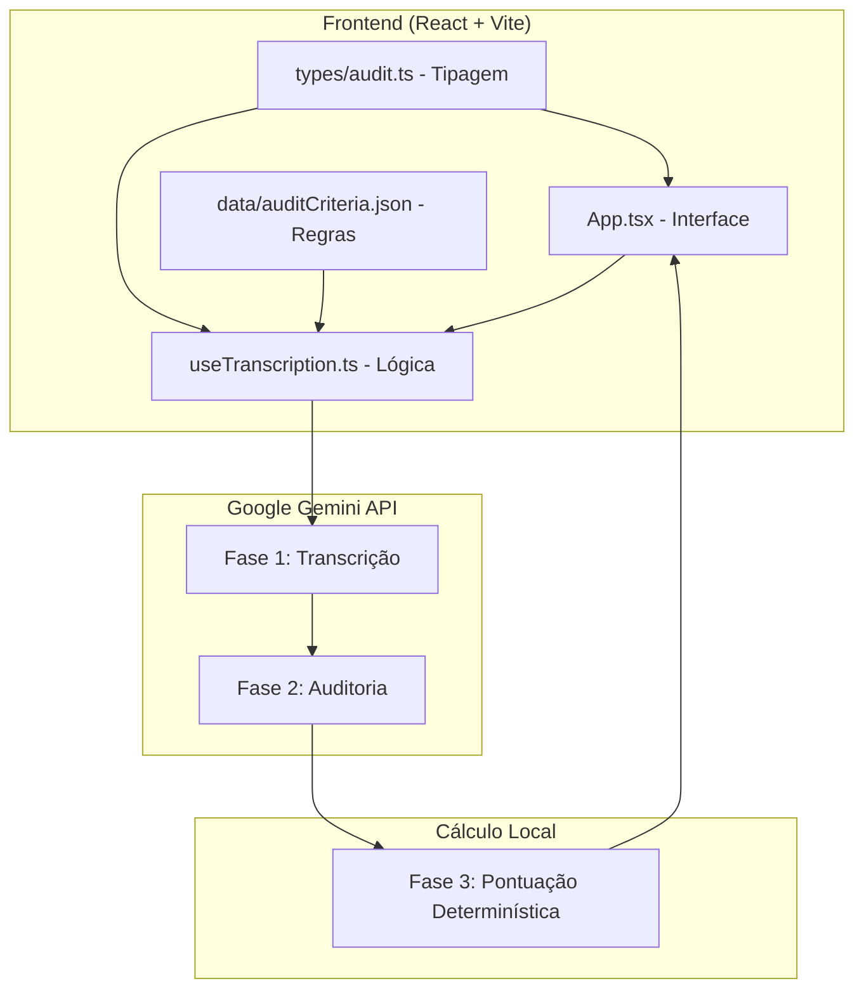

# 📋 Relatório Completo da Aplicação

## Auditoria Opentech - Athena v3.0

**Data:** 2026-01-17  
**Versão:** 3.0 (Beta)  
**Stack:** React 19 + TypeScript + Vite + TailwindCSS + Google Gemini AI

---

## 🎯 Objetivo da Aplicação

Sistema de **Auditoria de Qualidade Paramétrica** para Call Centers, utilizando **IA Generativa (Gemini)** para:

1. **Transcrever** áudios de ligações telefônicas
2. **Auditar** automaticamente a performance do operador baseado em critérios configuráveis
3. **Pontuar** de forma determinística usando pesos pré-definidos

---

## 🏗️ Arquitetura



---

## 📁 Estrutura de Arquivos

```
d:\auditoria\
├── src/
│   ├── App.tsx                    # Interface principal
│   ├── main.tsx                   # Entry point React
│   ├── index.css                  # Estilos globais (Tailwind)
│   ├── App.css                    # Estilos específicos
│   │
│   ├── hooks/
│   │   ├── useTranscription.ts    # Hook principal (transcrição + auditoria)
│   │   └── useCriteria.ts         # Hook para extração de PDF (opcional)
│   │
│   ├── types/
│   │   └── audit.ts               # Interfaces TypeScript
│   │
│   └── data/
│       ├── auditCriteria.json     # Banco de regras de auditoria
│       ├── criteria.json          # Critérios extraídos (backup)
│       └── index.ts               # Helper de acesso aos dados
│
├── criterios-auditoria/           # PDFs originais de critérios
│   ├── criteria.md                # Critérios extraídos em Markdown
│   └── POP - AUDITORIA...pdf      # Documento fonte
│
├── backup/                        # Backup do projeto
│   └── project_backup.zip
│
├── package.json                   # Dependências
├── vite.config.ts                 # Configuração Vite
├── tailwind.config.js             # Configuração Tailwind
└── .env                           # Chave API (VITE_GEMINI_API_KEY)
```

---

## 📊 Modelo de Dados

### Interfaces TypeScript (audit.ts)

```typescript
// Critério individual de auditoria
interface AuditCriterion {
    id: string;        // Identificador único
    label: string;     // Texto do critério
    weight: number;    // Peso na pontuação
}

// Tipo de alerta (cenário de auditoria)
interface AuditAlert {
    id: string;
    label: string;
    context: string;           // Contexto para a IA
    criteria: AuditCriterion[];
}

// Setor operacional
interface AuditSector {
    id: string;
    label: string;
    alerts: AuditAlert[];
}

// Resultado da auditoria
interface AuditResult {
    score: number;             // Pontuação obtida
    maxPossibleScore: number;  // Pontuação máxima possível
    summary: string;           // Resumo da IA
    details: AuditResultDetail[];
}
```

---

## 🔄 Fluxo de Processamento

### Fase 1: Transcrição (Gemini)
- Recebe o áudio em Base64
- Envia para `gemini-2.0-flash` com prompt de transcrição
- Identifica falantes como `[Operador]` e `[Interlocutor]`

### Fase 2: Auditoria (Gemini)
- Recebe a transcrição + lista de critérios do JSON
- Prompt dinâmico baseado no contexto do alerta selecionado
- Retorna JSON com status de cada critério (`pass`, `fail`, `partial`, `na`)

### Fase 3: Pontuação (Local/Determinística)
- **NÃO depende da IA** para calcular a nota
- Itera sobre os resultados e aplica os pesos do JSON
- `pass` = 100% do peso
- `partial` = 50% do peso
- `fail` = 0% do peso
- `na` = não afeta a pontuação máxima

---

## 📋 Setores e Alertas Disponíveis

| Setor | Alertas |
|-------|---------|
| 4.1 Monitoramento de Risco | Alerta Prioritário (Motorista/Cliente), Posição em Atraso, Parada Indevida |
| 4.2 Cadastro | Antecedentes (Receptivo) |
| 4.3 Logística Unilever | Devolução, Cabinets |
| 4.4 Logística Geral | Estadia |

---

## 🛠️ Dependências Principais

| Pacote | Versão | Uso |
|--------|--------|-----|
| `@google/genai` | ^1.35.0 | SDK oficial do Google Gemini |
| `react` | ^19.2.0 | Framework UI |
| `lucide-react` | ^0.562.0 | Ícones |
| `tailwindcss` | ^4.1.18 | Estilização |
| `vite` | ^7.2.4 | Build/Dev Server |

---

## 🚀 Como Executar

```bash
# 1. Instalar dependências
npm install

# 2. Configurar API Key (criar arquivo .env)
echo "VITE_GEMINI_API_KEY=sua_chave_aqui" > .env

# 3. Rodar em desenvolvimento
npm run dev

# 4. Build para produção
npm run build
```

---

## ✅ Status do Projeto

- [x] Transcrição de áudio com Gemini
- [x] Auditoria paramétrica baseada em JSON
- [x] Cálculo determinístico de pontuação
- [x] Seleção dinâmica de Setor/Alerta
- [x] Interface responsiva com Tailwind
- [x] Build sem erros TypeScript
- [x] Backup e versionamento Git

---

## 📝 Próximos Passos Sugeridos

1. **Exportação de Relatórios**: Gerar PDF/Excel com o resultado da auditoria
2. **Histórico**: Salvar auditorias anteriores (localStorage ou backend)
3. **Edição de Critérios**: Interface para adicionar/editar critérios no JSON
4. **Batch Processing**: Processar múltiplos áudios em sequência
5. **Dashboard**: Visualização agregada de métricas de qualidade

---

## 🔗 Links Importantes

- **Repositório GitHub:** https://github.com/lucaslfa84/auditoria
- **Google AI Studio:** https://aistudio.google.com/
- **Documentação @google/genai:** https://googleapis.github.io/js-genai/
